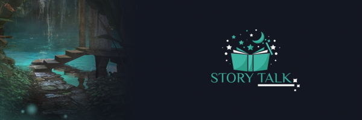
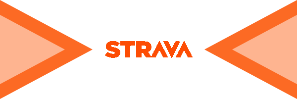

## StoryTalk
I built a website with MERN stack, using GPT-3 and DALL-E APIs to make personalized bedtime stories based on user input. Demonstrates full-stack skills and integrating advanced tech into user-friendly apps.
- 
- Tags: AI
- Badges:
  - AI [blue]
  - Mern [green]
  - Devops [red]
- Buttons:
  - Visit [https://storytalk.ai]

## Voxhub
A website that utilizes the MERN (MongoDB, Express.js, React, Node.js) stack and third-party tools like the OpenAI API and Amazon Polly. This comprehensive technology stack enables users to converse with ChatGPT using their own voice and receive responses in custom voices, creating a personalized and engaging conversational experience.
- 
- Tags: AI
- Badges:
  - AI [blue]
  - Mern [green]
  - Github [black]
- Buttons:
  - Video [https://vimeo.com/862453925]

## Application with Strava API Integration
I created a dynamic MERN app integrating the Strava API, highlighting my full-stack expertise, API integration, user authentication skills, and commitment to innovative, user-friendly solutions.
- 
- Tags: Mern
- Badges:
  - Mern [green]
  - Strava [orange]
